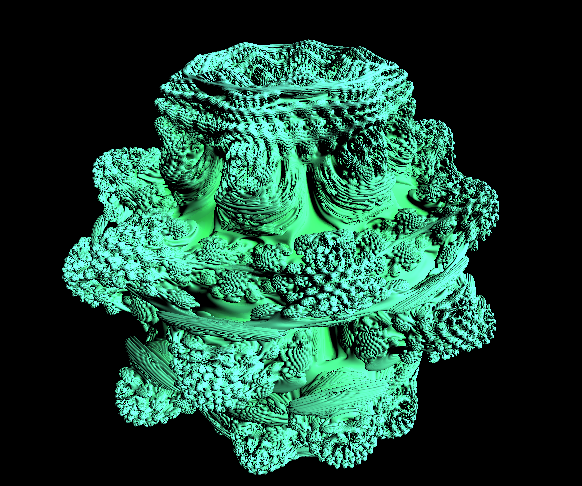

# Mandelbulb
Mandelbuld with spheare tracing using CUDA and Vulkan

## Techonologies

- C++
- CUDA
- Vulkan
- GLSL

## Mandelbulb

I'm using sphere tracing to render the mandelbuld. 
The mandelbuld is colored using the number of iterations it took to escape the mandelbulb and the distance to it.
Then I calculate the normal of the mandelbulb using the gradient of the distance field and shade it using the normal and a predefined light direction.
To calculate the distance to the mandelbulb I use a formula which can be found [here](https://www.iquilezles.org/www/articles/mandelbulb/mandelbulb.htm).
After that I set the maximum distance the ray can travel and the maximum number of iterations to escape the mandelbulb.

## Result

The image above is the result of the mandelbulb rendered using the sphere tracing algorithm.
It can run realtime on a RTX 3060 graphics card, which is designed for laptops.